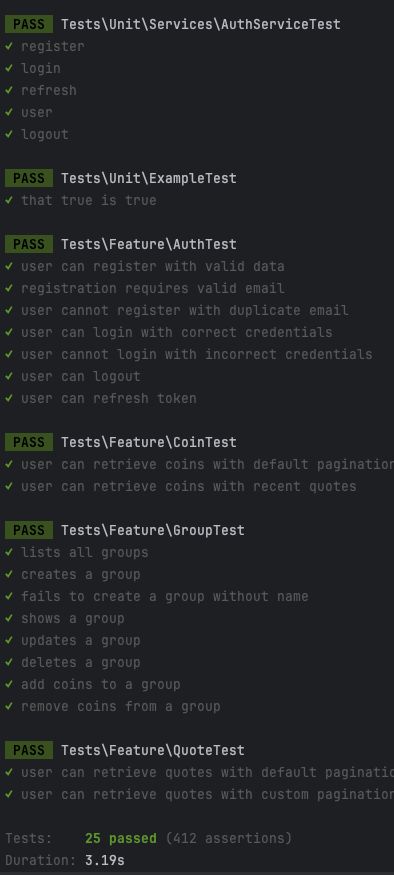

# Coins Manager API 🪙

O projeto é uma aplicação que consome dados da API do CoinMarketCap, armazena essas informações em um banco de dados relacional e disponibiliza via uma API autenticada. Ele permite o acesso a dados históricos de criptomoedas, incluindo nome, market cap, preço, volume de 24 horas e variação de preço. Além disso, suporta filtros e ordenação por nome, preço e ranking, e oferece um CRUD para gerenciar grupos personalizados de moedas.

## Pré-requisitos ✅

- Composer
- Docker
- Docker Compose
- git

**Importante:** Laravel Sail utiliza a porta `3306` para o MySQL por padrão. Certifique-se de que esta porta esteja disponível 🚦 ou ajuste a configuração conforme necessário.

## Como Clonar o Projeto 📋

Para clonar o projeto, abra um terminal e execute o seguinte comando:

```bash
git clone https://github.com/billyfranklim1/coins-manager-api.git
```

🎉 Após clonar o repositório, entre no diretório do projeto:

```bash
cd api-login
```

## Configuração Inicial 🔧

Copie o arquivo `.env.example` para `.env` para configurar o ambiente:

```bash
cp .env.example .env
```

## Instalação e Configuração do Laravel Sail 🚀

Instale as dependências do projeto:

```bash
composer install --ignore-platform-reqs
```

Inicie os contêineres Docker com Laravel Sail 🐳:

```bash
./vendor/bin/sail up --build
```

Gere a chave da aplicação Laravel 🔑:

```bash
./vendor/bin/sail artisan key:generate
```

Execute as migrações para criar as tabelas no banco de dados 🗃️:

```bash
./vendor/bin/sail artisan migrate
```

Execute o comando abaixo para popular a tabela de moedas com as 100 moedas mais valiosas do CoinMarketCap:

```bash
./vendor/bin/sail artisan coin:save
```

Agora execute o comando para buscar as contações das moedas:

```bash
./vendor/bin/sail artisan crypto:fetch
```

### 🚨 **Importante:** O comando `crypto:fetch` ficará rodando a cada 5 minutos em um cron para atualizar as cotações das moedas.

## Como Rodar os Testes 🧪

Execute os testes de integração com:

```bash
./vendor/bin/sail artisan test
```

Se tudo estiver configurado corretamente, você verá a saída dos testes no terminal semelhante à imagem abaixo:
<p align="center">
  
</p>

[//]: # (## Gerando Documentação 📄)

[//]: # (```bash)

[//]: # (./vendor/bin/sail php artisan l5-swagger:generate)

[//]: # (```)

[//]: # ()
[//]: # (Se tiver ocorrido tudo bem, a documentação estará disponível em `http://localhost/api/documentation`. E você verá algo semelhante à imagem abaixo:)

[//]: # (<p align="center">)

[//]: # (  )

[//]: # (</p>)

## Acessando a Aplicação 🌐

A API estará acessível através do `http://localhost:80`.


## Possíveis Erros e Soluções 🛠️

- **Erro**: Porta `3306` já está em uso 🚫.
    - **Solução**: Verifique se nenhum outro serviço está usando a porta `3306`. Se necessário, ajuste a porta no seu arquivo `.env` e `docker-compose.yml`.

- **Erro**: Permissões ao executar o Sail ⚠️.
    - **Solução**: Execute os comandos do Sail com `sudo` ou adicione seu usuário ao grupo Docker.

## Contribuindo 🤝

Sinta-se à vontade para contribuir com o projeto. Abra uma issue ou envie um pull request com suas sugestões e melhorias.

## Licença 📝

Este projeto está licenciado sob a [Licença MIT](LICENSE).
